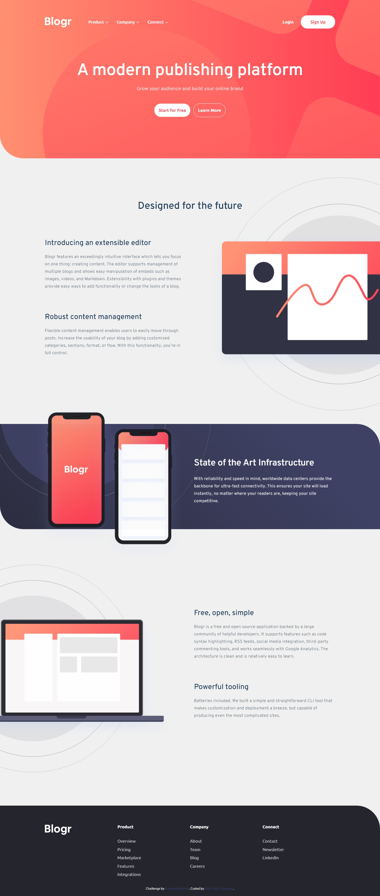
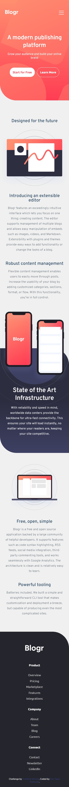

# Frontend Mentor - Blogr landing page solution

This is a solution to the [Blogr landing page challenge on Frontend Mentor](https://www.frontendmentor.io/challenges/blogr-landing-page-EX2RLAApP). Frontend Mentor challenges help you improve your coding skills by building realistic projects. 

## Table of contents

- [Overview](#overview)
  - [The challenge](#the-challenge)
  - [Screenshot](#screenshot)
  - [Links](#links)
- [My process](#my-process)
  - [Built with](#built-with)
  - [What I learned](#what-i-learned)
  - [Continued development](#continued-development)
  - [Useful resources](#useful-resources)
- [Author](#author)

## Overview

### The challenge

Users should be able to:

- View the optimal layout for the site depending on their device's screen size
- See hover states for all interactive elements on the page

### Screenshot

#### Desktop



#### Mobile



### Links

- Solution URL: [https://github.com/rontoyhacao/Blogr-landing-page](https://github.com/rontoyhacao/Blogr-landing-page)
- Live Site URL: [https://blogr-landing-page-rontoyhacao.vercel.app/](https://blogr-landing-page-rontoyhacao.vercel.app/)

## My process

### Built with

- Semantic HTML5 markup
- CSS custom properties
- [Sass](https://sass-lang.com/)
- Javascript
- [GSAP](https://greensock.com/gsap/)
- Flexbox
- CSS Grid
- Mobile-first workflow

### What I learned

This is my very first landing page and it took me days to finish it. This project tested my Javascript skills especially with the hamburger menu part on mobile. It has shown me how navigation menu changes from desktop to mobile and I used `relative` and `absolute` position property in CSS to sort it out. It also tested my skill in adding a background svg with `background-image` property. I tried to use GSAP because I was curious about it and I'm not sure if I'm gonna use it again since I'm not really a fan of animations. It is as well my first time in doing mobile-first approach.

This is how I created the hamburger menu in JS:

```js
const hamburger = document.querySelector('.toggle');
const mobileNav = document.querySelector('.toggle-nav');

hamburger.addEventListener('click', () => {
    mobileNav.classList.toggle('show');
    hamburger.classList.toggle('open');
});
```

As you can see above, I used the `toggle` method to show and hide the hamburger menu everytime the mobile breakpoint is met.

I also used a certain width of the whole page so that it won't get cluttered when zoomed out.

```css
@mixin container-width-mobile {
    margin: 0 auto;
    max-width: 1100px;
    width: 85%;
}
```

### Continued development

After making this project, I realized that having the mobile-first approach is an edge in doing a project because most people use mobile phones nowadays in browsing the web and it is more convenient in my experience particularly with media-queries because there will be less breakpoints to deal with. I think I'm gonna be sticking with that approach in my future projects.

### Useful resources

- [Animated Hamburger Menu Tutorial - CSS Effects](https://www.youtube.com/watch?v=dIyVTjJAkLw) - This Youtube video helped me in adding the hamburger menu as well with animations.

## Author

- Website - [Ron Paolo Toyhacao](https://www.your-site.com)
- Frontend Mentor - [@rontoyhacao](https://www.frontendmentor.io/profile/rontoyhacao)
- Twitter - [@rontoyhacao](https://twitter.com/rontoyhacao)

